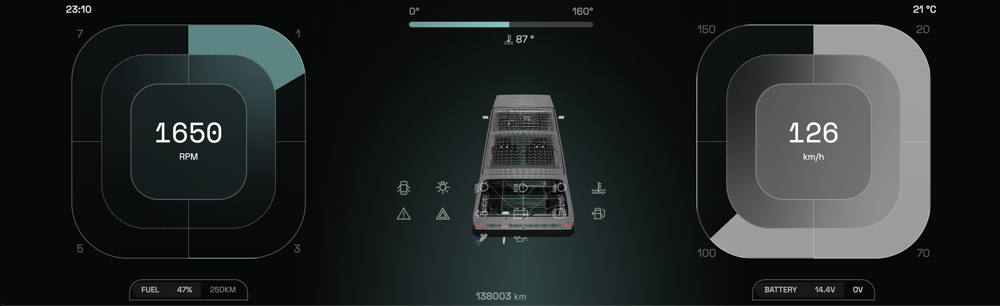

# 🚗 Cyberpandino Cluster - PandaOS

[](https://www.gnu.org/licenses/gpl-3.0)
[](https://github.com/cyberpandino/cluster/releases)
[](https://nodejs.org/)
[](https://www.raspberrypi.com/)
[](https://github.com/cyberpandino/cluster/blob/main/.github/CONTRIBUTING.md)

Digital instrument cluster for the Fiat Panda 141, powered by Raspberry Pi 4B.

## 📋 Description

A complete digital instrument cluster system that replaces the original analog dashboard of the Fiat Panda 141.  
The system interfaces with the ECU using the OBD-II protocol (ELM327) and reads the indicator lights through optocouplers connected to the Raspberry Pi's GPIO pins.


### Main Features (v0.9.0)

- ✅ **OBD-II data reading**: Speed, RPM, temperature, oil pressure, etc.
- ✅ **Vehicle indicator detection**: High beams, low beams, turn signals, oil levels, etc.
- ✅ **External sensors**:
  - External temperature (DS18B20)
  - Fuel level (ADS1115)
- ✅ **Ignition cluster management**: Automatic power-saving system
- ✅ **Modern interface**: 3D dashboard with an interactive Panda model
- ✅ **Demo mode**: For development without hardware

---

## 📸 Preview

### Main Dashboard

The digital cluster fully replaces the original analog dashboard with a modern and customizable interface.

<div align="center">
  
  <p><em>Main dashboard with interactive 3D model</em></p>
</div>

---

### 🗺️ Upcoming Features

Discover what we're planning next: [Roadmap & Wishlist](ROADMAP.md)

Some items on the list:
- 📹 Rear camera and parking sensors
- 🚪 Advanced 3D animations (doors, lights)
- 🎨 Customizable dashboards and themes
- 🌍 Internationalization
- 📱 Companion mobile app
- And much more!

Want to contribute? Every help is welcome! See the [contribution guide](.github/CONTRIBUTING.md).

---

## 📚 Documentation Index

### 🚀 Start Here
- **[Quick Start](QUICK_START.md)** - Quick start guide
- **[Hardware](HARDWARE.md)** - Full component list and wiring diagram

### 📖 Technical Documentation
- **[Architecture](ARCHITETTURA.md)** - Detailed system architecture
- **[General Documentation](DOCUMENTAZIONE.md)** - Complete project overview
- **[Client Configuration](client/CONFIGURAZIONE.md)** - Frontend setup and configuration
- **[Server Configuration](server/CONFIGURAZIONE_SERVER.md)** - Backend setup and configuration
- **[Environment Configuration](client/src/config/README.md)** - Environment variables and parameters

### 🤝 Contribution
- **[How to Contribute](.github/CONTRIBUTING.md)** - Full guide for contributing to the project

### 📋 Other
- **[Roadmap](ROADMAP.md)** - Development plan and wishlist
- **[Authors](AUTHORS.md)** - Project contributors
- **[License](LICENSE)** - GNU General Public License v3.0

---

## ⚠️ Disclaimer

PandaOS is a hobbyist and experimental project, born from technical curiosity and a taste for digital adventure.  
It is not a certified product, it is not intended for production use, and it makes no claim to comply with industrial, automotive, or intergalactic standards.

All material in this repository — including code, guides, diagrams, and ideas of varying degrees of sanity — is provided "AS IS", with no guarantees regarding functionality, reliability, or compatibility with the electrical system of your heroic little vehicle.

The authors and contributors assume no responsibility in the event of:

* electrical or electronic failures  
* abnormal vehicle behavior  
* unexpected short circuits  
* damage to people, property, animals, or anything else  
* any side effect resulting from the use of the software or from following the instructions in this documentation  

Using PandaOS on vehicles in circulation, or in any context where compliance, certification, or basic common sense might be required, is strongly discouraged.  
Any installation or experimentation is carried out entirely at the user's own risk, who assumes full responsibility for the technical and practical consequences of their choices.


---

## 🏗️ Architecture

The project is composed of three main modules:

```
cluster/
├── client/          → Graphical interface (React + Vite + Electron)
├── server/          → Backend for OBD-II and GPIO communication (Node.js)
└── main.js          → Electron wrapper for the desktop app
```

### Technologies Used

- **Frontend**: React 18, TypeScript, Three.js, Socket.IO Client
- **Backend**: Node.js, Socket.IO Server, SerialPort, GPIO (onoff)
- **Desktop**: Electron 36
- **Hardware**: Raspberry Pi 4B, ELM327, DS18B20, ADS1115

### 🤔 React + Electron in an Automotive Environment?! Are You Insane?

Yes, we know. Any embedded engineer looking at this project is probably having a panic attack right now.

**How things *should* be done properly:**
- **C/C++** - Because JavaScript in a car is like putting square wheels on it 
- **Qt/QML** - The industry standard (Tesla, Audi, BMW all use it) 
- **Yocto/Buildroot** - Serious embedded Linux, not Raspberry Pi OS with all the clutter  
- **Direct framebuffer** - Not Electron running an entire browser just to show four numbers  

**So why React/Electron/Node.js?**

Because this is a **hobby project** and we want to **have fun**, not lose our minds.

**Pros of our questionable approach**:
- ⚡ **Fast to develop** - Have you seen Three.js? You can make a 3D model in five minutes. Try doing that with native OpenGL.
- 🎨 **Libraries everywhere** - npm has everything. C++ has… well… Boost?
- 🧑‍💻 **Accessible** - Know React? Welcome. Know CMake? My condolences.
- 🐛 **Debugging** - Press F12 and you see everything. GDB is… an experience.
- 🚀 **Fun** - More time tinkering, less time fighting toolchains
- 💡 **Proof of concept** - Does it work? Great! We'll figure out the rest later.

**Cons of our questionable approach (which we knowingly accept)**:
- 💾 **Eats RAM** like pasta (~500MB vs ~50MB)
- 🐌 **Slow boot** (~30s vs ~3s) - but with a standby mode always on, it becomes instant
- 🔋 **Consumes** more than it should (but standby is only 0.4W, negligible)
- 📊 **JavaScript** - Yes, JavaScript. In a car. Deal with it.

**The point is**: We're talking about a **1990 Fiat Panda**, not an F-35. It's not going to the Moon.  
It just needs to show your RPM in a cool way while you listen to Pink Floyd. And it does that beautifully. 🚗💨

> 💡 **Want to rewrite it in C++/Qt "the proper way"?** Awesome! We'd love to see a native port—and we'd gladly help you with it.

---

## ⚙️ System Requirements

### Software Prerequisites

| Software | Minimum Version | Recommended |
|----------|----------------|-------------|
| **Node.js** | 18.0.0 | 20.x LTS |
| **npm** | 9.0.0 | 10.x |
| **Git** | 2.0+ | Latest |

```bash
# Quick Check
node --version  # >= v18.0.0
npm --version   # >= 9.0.0
git --version   # >= 2.0.0
```

⚠️ **Raspberry Pi**: do NOT use `apt install nodejs` (it installs an outdated version). See [CONFIGURAZIONE_SERVER.md](server/CONFIGURAZIONE_SERVER.md#2-installazione-nodejs-e-npm) for NodeSource/nvm instructions.

---

### For Raspberry Pi (Production)

- **Hardware**:
  - Raspberry Pi 4B (4GB or higher recommended) or Raspberry Pi 5
  - USB ELM327 adapter (serial port `/dev/ttyUSB0`) 
  - Optocouplers for indicator light detection (PC817 or similar) 
  - Ultra-wide LCD display (1920×480 recommended)  
  - DS18B20 temperature sensor (optional)
  - ADS1115 ADC converter (optional, for fuel level sensor)

📋 **Full hardware list**: See [HARDWARE.md](HARDWARE.md) for details on all required components.

- **Operating System**:
  - Raspberry Pi OS Lite (64-bit) - Debian-based recommended
  - Boot time: ~30s (optimizable to ~20s, or instantaneous with standby mode)
  - ARM/ARM64 architecture
  
  > 📘 **OS Choice & Boot Time**: See [CONFIGURAZIONE_SERVER.md](server/CONFIGURAZIONE_SERVER.md#1-installazione-sistema-operativo) for details on choosing the right distro, optimizing boot time, and configuring the **always-on standby mode** (negligible power usage, instant wake).

- **Software**: See [CONFIGURAZIONE_SERVER.md](server/CONFIGURAZIONE_SERVER.md#2-installazione-nodejs-e-npm) for installation instructions on Raspberry Pi.

### For Local Development (Mac/Windows/Linux)

- Node.js 18+ (20 LTS recommended)
- npm 9+ (10.x recommended)
- Git 2.0+

> 💡 **Quick Setup**: See the installation instructions in the [Software Prerequisites](#software-prerequisites) section above.

⚠️ **NOTE**: When running the project on non-Raspberry Pi systems, the server will fail to start due to missing required hardware dependencies (GPIO, sensors, OBD serial port). You can use the **mock mode** in the client for development without a server.

---

## 🚀 Project Setup

### 1. Clone the Repository

```bash
git clone https://github.com/cyberpandino/cluster
cd cluster
```

### 2. Install Dependencies

The project includes an installation script that configures all dependencies:

```bash
npm run install:all
```

This command installs dependencies for:
- Root (Electron + concurrently)
- Client (React + frontend dependencies)
- Server (Node.js + hardware dependencies)

### 3. Configuration

#### a) Client Configuration

Edit the client configuration file:

**File**: `client/src/config/environment.ts`

```typescript
export const environment: EnvironmentConfig = {
  websocket: {
    url: 'http://127.0.0.1:3001',  // WebSocket server URL
    mock: true,                      // true = demo mode | false = real connection
    reconnectionAttempts: 3,
    reconnectionDelay: 1000,
    timeout: 5000,
  },
  debug: {
    enabled: true,                   // Enable debug mode
    showConsoleViewer: true,         // Show console viewer (key 'd')
  },
  app: {
    name: "PandaOS Cluster",
    version: "0.9.0",
    locale: "it",
    timezone: "Europe/Rome",
    timeFormat: "24h",
  },
};
```

**Key Parameters**:
- `websocket.url`: Address of the WebSocket server (default: `http://127.0.0.1:3001`)
- `websocket.mock`: 
  - `true` = Demo mode with simulated animations (local development)
  - `false` = Real server connection (production on Raspberry Pi)
- `debug.enabled`: Enables debugging features
- `debug.showConsoleViewer`: Shows debug console viewer (activated by pressing d)

#### b) Server Configuration

Edit the GPIO and sensor configuration file:

**File**: `server/config/gpio-mapping.js`

See the [GPIO Configuration](#gpio-and-sensor-configuration) section for full details.

---

## 🎯 Project Launch

### Full Mode (Raspberry Pi)

Start client, server, and Electron simultaneously:

```bash
npm start
```

This command runs:
1. OBD-II server on port 3001
2. React/Vite client on port 5173
3. Electron desktop app

### Development Mode (Local without Raspberry Pi)

#### Option 1: Client Only (Mock Mode)

1. Make sure `websocket.mock = true` in `client/src/config/environment.ts`
2. Start the client only:

```bash
npm run client
```

The application will be available at `http://localhost:5173` with simulated data.

#### Option 2: Client + Electron

```bash
npm run client    # In one terminal
npm run electron  # In another terminal
```

### Individual Commands

```bash
# Server only (requires Raspberry Pi)
npm run server

# Client only
npm run client

# Electron only (waits for client on port 5173)
npm run electron
```

---

## 🔌 GPIO and Sensor Configuration

### GPIO Mapping for Vehicle Indicators

The file `server/config/gpio-mapping.js` contains the full GPIO pin mapping.

> 📘 **Vehicle Wiring Diagram**: To identify the correct indicator light wires on the original Panda dashboard, refer to the [Official Electrical Scheme Fiat Panda 141](http://www.bunkeringegnere.altervista.org/esplosi/FIAT%20PANDA/panda%20141/1100%20mpi/55%20IMPIANTO%20ELETTRICO%20-%20SCHEMI%20-%20GAMMA%202000.pdf) including all color codes and connections.

#### Used Pins

| Indicator / Function | GPIO Pin (BCM) | Description |
|---------------|----------------|-------------|
| Turn signals | 17 | Direction indicators |
| Alternator | 27 | Battery charging |
| Oil pressure | 22 | Engine oil pressure |
| Brake system | 23 | Brakes |
| Injectors | 24 | Injection system |
| Ignition ON (KEY) | 25 | Ignition key inserted |
| High beams | 5 | High beam lights |
| Low beams | 6 | Low beam lights |
| Hazard lights | 12 | Hazard lights |
| Rear fog light | 13 | Rear fog lamp |
| Coolant temperature | 16 | Coolant temperature sensor |
| Rear defroster | 19 | Rear window defroster |
| Fuel reserve | 20 | Low fuel indicator |
| Ignition (cluster) | 21 | Ignition ON/OFF detection |

#### Optocoupler Configuration

```javascript
config: {
  mode: 'BCM',              // Broadcom GPIO numbering
  pullMode: 'PUD_DOWN',     // Internal pull-down resistor
  debounceTime: 50,         // Debounce filter (ms)
  pollingInterval: 100,     // GPIO reading frequency (ms)
}
```

**Logic**:
- `HIGH (1)` = Indicator ON
- `LOW (0)` = Indicator OFF

### Ignition Management

```javascript
ignition: {
  enabled: true,
  pin: 21,                  // Dedicated GPIO pin
  activeOn: 0,              // 0 = active low | 1 = active high
  scripts: {
    lowPower: './scripts/low-power.sh',   // Executed when ignition turns off
    wake: './scripts/wake.sh',             // Executed when ignition turns on
  },
}
```

The power-saving scripts can be customized to:
- Turn off the display
- Reduce brightness
- Disable non-essential services
- Trigger a controlled shutdown

### External Temperature Sensor (DS18B20)

```javascript
temperature: {
  enabled: true,
  sensorId: null,           // null = auto-detect first sensor
  basePath: '/sys/bus/w1/devices',
  readInterval: 5000,       // Read interval
  pin: 4,                   // GPIO 4 (default for 1-Wire)
}
```

**Hardware Setup**:
1. Connect DS18B20 to GPIO 4
2. Enable 1-Wire: `sudo raspi-config` → Interface Options → 1-Wire
3. Verify sensor presence: `ls /sys/bus/w1/devices/`

### Fuel Sensor (ADS1115 - ADC I2C)

```javascript
fuel: {
  enabled: true,
  chip: 0,                  // 0 = ADS1115 | 1 = ADS1015
  channel: 0,               // Channel A0 (0-3 available)
  gain: 4096,               // ±4.096V full-scale
  sampleRate: 250,          // Sample rate (SPS)
  readInterval: 500,        // Read interval (ms)
  
  // Voltage divider configuration
  voltageDivider: {
    r1: 100000,             // 100kΩ
    r2: 33000,              // 33kΩ
  },
  
  // Voltage → percentage calibration
  calibration: {
    voltageEmpty: 0.5,      // Voltage when tank is empty (V)
    voltageFull: 4.0,       // Voltage when tank is full (V)
  },
  
  pins: {
    sda: 2,                 // GPIO 2 (SDA I2C)
    scl: 3,                 // GPIO 3 (SCL I2C)
  },
}
```

**Hardware Setup**:
1. Connect ADS1115:
   - VDD → 3.3V
   - GND → GND
   - SDA → GPIO 2
   - SCL → GPIO 3
   - A0 → Fuel sensor (through voltage divider)
2. Enable I2C: `sudo raspi-config` → Interface Options → I2C
3. Verify presence: `sudo i2cdetect -y 1`

### OBD-II Serial Port

**File**: `server/services/OBDCommunicationService.js`

```javascript
constructor() {
  this.portPath = '/dev/ttyUSB0'; //ELM327 port
  this.port = null;
  this.baudRate = 38400; // Communication speed
}
```

**Hardware Setup**:
1. Plug in the ELM327 USB adapter
2. Check detected port: `ls -l /dev/ttyUSB*`
3. Grant permissions: `sudo usermod -a -G dialout $USER`
4. Reboot or re-login to apply permissions

**Alternative Serial Port Configuration:**

If the OBD adapter appears on a different device (eg. `/dev/ttyUSB1`, `/dev/ttyACM0`), modify:

```javascript
// In server/services/OBDCommunicationService.js (line 7)
this.portPath = '/dev/ttyUSB1';  // change this value
```

---

## 🔧 PM2 Configuration (Automatic Startup)

To run the server as a system service on Raspberry Pi:

### 1. Install PM2

```bash
sudo npm install -g pm2
```

### 2. Configure Ecosystem

Edit `server/ecosystem.config.js`:

```javascript
module.exports = {
  apps: [{
    name: 'obd-server',
    script: './server.js',
    cwd: '/home/pi/cockpit/server',  // ⚠️ CHANGE THIS PATH
    instances: 1,
    autorestart: true,
    watch: false,
    max_memory_restart: '200M',
    restart_delay: 2000,
    max_restarts: 15,
    min_uptime: '10s',
    exp_backoff_restart_delay: 100,
    env: {
      NODE_ENV: 'production',
      PORT: 3001
    },
    log_file: './logs/obd-combined.log',
    out_file: './logs/obd-out.log',
    error_file: './logs/obd-error.log',
    log_date_format: 'YYYY-MM-DD HH:mm:ss Z',
    merge_logs: true
  }]
};
```

### 3. Start with PM2

```bash
cd server
mkdir -p logs
pm2 start ecosystem.config.js
pm2 save
pm2 startup
```

### 4. Useful PM2 Commands

```bash
pm2 status              # Stato servizi
pm2 logs obd-server     # Visualizza log
pm2 restart obd-server  # Riavvia servizio
pm2 stop obd-server     # Ferma servizio
pm2 monit               # Monitor in tempo reale
```

---

## 🛠️ Troubleshooting

### Server does not start on non-Raspberry systems

**Error**:
```
❌ ERRORE: Dipendenze Raspberry Pi essenziali non disponibili
Piattaforma non supportata: darwin arm64 - richiesto Linux ARM
```
*Translation*
Error: essential Raspberry dependencies not available
Platform not supported: darwin arm64 - Linux ARM required
 

**Solution**: 
- Use mock mode in the client (`websocket.mock = true`)
- Or run the server only on a Raspberry Pi

### Installation error: Python 3.13 / node-gyp incompatible

**Error** (during `npm install` in the server):
```
gyp ERR! stack TypeError: Cannot assign to read only property 'cflags'
gyp info using node-gyp@7.1.2
gyp info using Python version 3.13.5
```

**Cause**: The `epoll` dependency (used by `onoff` for GPIO) relies on an older `node-gyp` version that is incompatible with Python 3.13+.

**Solutions**:

**Option 1: Install with --ignore-scripts (Recommended for dev)**
```bash
cd server
npm install --ignore-scripts
```

This skips the compilation of native dependencies (GPIO, SerialPort). Ideal for:
- ✅ Development on laptops/desktops
- ✅ CI/CD pipelines
- ✅ Systems with Python 3.13+
- ❌ NOT suitable for Raspberry Pi (native modules must be compiled)

**Option 2: Downgrade Python (only if needed for Raspberry Pi)**
```bash
# Install Python 3.11 (compatible with node-gyp)
sudo apt install python3.11
sudo update-alternatives --install /usr/bin/python3 python3 /usr/bin/python3.11 1
```

**Option 3: DEV_MODE (server development)**
```bash
cd server
npm install --ignore-scripts
DEV_MODE=true node server.js
```

⚠️ In DEV_MODE the server starts but is not fully functional (no GPIO/OBD). Use only for testing.

**Note**: Hardware-related dependencies (`onoff`, `serialport`, `ads1x15`) are listed as `optionalDependencies` - their failure does not block the installation of other dependencies.

### ELM327 not found

**Error**:
```
Porta /dev/ttyUSB0 non trovata
```

*Translation*
Error: Port /dev/ttyUSB0 not found

**Solution**:
1. Check the port: `ls -l /dev/ttyUSB*`
2. Check permissions: `sudo usermod -a -G dialout $USER`
3. Update the port in `OBDCommunicationService.js` if it differs

### Temperature sensor not found

**Avviso**:
```
⚠️ Sensore temperatura DS18B20 non disponibile (1-Wire non trovato)
```

*Translation*
Temperature sensor DS18B20 not available (1-Wire not found)

**Soluzione**:
1. Enable 1-Wire: `sudo raspi-config` → Interface Options → 1-Wire
2. Restart: `sudo reboot`
3. Verify: `ls /sys/bus/w1/devices/`
4. If not needed, disable it in `gpio-mapping.js`: `temperature.enabled = false`

### Fuel sensor not responding

**Avviso**:
```
⚠️ Sensore carburante ADS1115 non disponibile
```

*Translation*
Fuel sensor ADS1115 not available 

**Solution**:
1. Enable I2C: `sudo raspi-config` → Interface Options → I2C
2. Verify connection: `sudo i2cdetect -y 1`
3. Check ADS1115 wiring
4. If not needed, disable it in `gpio-mapping.js`: `fuel.enabled = false`

### Electron does not start

**Error**:
```
Error: connect ECONNREFUSED 127.0.0.1:5173
```

**Solution**:
The Vite client must be running first. Use `npm start` which handles the startup order automatically.

### GPIO not responding

**Problem**: Indicator lights are not being detected.

**Solution**:
1. Check optocoupler wiring
2. Test pins: `gpio readall` (install wiringPi if needed)
3. Check pin mapping in `gpio-mapping.js`
4. Verify the active high/low logic of the optocouplers

---

## 📱 Application Usage

### Keyboard Controls

- **`d`**: Open debug console
- **`ESC`**: Close debug console
- **`r`**: Reload application

### Debug Console

Press `d` to open the interactive console, which shows:
- WebSocket logs
- Connection errors
- Real-time OBD-II data
- GPIO and sensor states

---

## 📦 Production Build

### Build Client

```bash
cd client
npm run build
```

Output in `client/dist/`
This folder contains the final production bundle.

### Build Electron

To create a distributable app:

1. Install electron-builder: `npm install --save-dev electron-builder`
2. Add a script in `package.json`:

```json
"scripts": {
  "build:electron": "electron-builder"
}
```

3. Run: `npm run build:electron`

---

## 📝 Main File Structure

```
cluster/
├── client/
│   ├── src/
│   │   ├── config/
│   │   │   └── environment.ts          ← Client configuration
│   │   ├── components/                 ← React components
│   │   ├── routes/
│   │   │   └── Cockpit/               ← Main dashboard
│   │   ├── services/
│   │   │   └── WebSocketService.ts    ← WebSocket client management
│   │   └── store/                     ← State management (Valtio)
│   └── package.json
│
├── server/
│   ├── config/
│   │   └── gpio-mapping.js            ← ⚙️ GPIO and sensor configuration
│   ├── services/
│   │   ├── OBDServer.js               ← Main server
│   │   ├── OBDCommunicationService.js ← ELM327 communication
│   │   ├── GPIOService.js             ← GPIO handling for indicators
│   │   ├── IgnitionService.js         ← Ignition management
│   │   ├── TemperatureSensorService.js← DS18B20 temperature sensor
│   │   └── FuelSensorService.js       ← ADS1115 fuel sensor
│   ├── scripts/
│   │   ├── low-power.sh               ← Power-saving script
│   │   └── wake.sh                    ← Wake script
│   ├── ecosystem.config.js            ← PM2 configuration
│   └── package.json
│
├── main.js                            ← Electron wrapper
└── package.json                       ← Main scripts
```

---

## 🔒 Security & Notes

- ⚠️ **Do not run as root**: Use a normal user with `dialout` and `gpio` groups
- 🔋 **Power-saving**: Ignition scripts can protect the system from battery drain
- 🧪 **Testing**: Always use mock mode when testing without hardware
- 📊 **Monitoring**: Use PM2 to monitor the server in production

---

## 📄 License

This project is released under the **GNU General Public License v3.0 or later**.

```
PandaOS
Copyright (C) 2025  Cyberpandino

This program is free software: you can redistribute it and/or modify
it under the terms of the GNU General Public License version 3.

This program is distributed in the hope that it will be useful,
but WITHOUT ANY WARRANTY; without even the implied warranty of
MERCHANTABILITY or FITNESS FOR A PARTICULAR PURPOSE. See the
GNU General Public License for more details.
```

The complete license text is available in the [LICENSE](LICENSE) file and at: https://www.gnu.org/licenses/gpl-3.0.html

---

## 👥 Contributing

All contributions are welcome! Whether it's code, documentation, bug reports, or suggestions.

### 🚀 Getting Started

1. Read the [contribution guide](.github/CONTRIBUTING.md)
2. Choose how you want to contribute:
   - 🐛 [Report a bug](.github/ISSUE_TEMPLATE/bug_report.md)
   - ✨ [Request a feature](.github/ISSUE_TEMPLATE/feature_request.md)
   - ❓ [Ask a question](.github/ISSUE_TEMPLATE/question.md)
   - 💻 Contribute code
   - 💡 Look for inspiration in the [Roadmap & Wishlist](.github/CONTRIBUTING.md#-vuoi-contribuire-ma-non-hai-idee)

### 📝 Contribution Workflow

1. **Fork** the repository
2. **Create a branch**: `git checkout -b feature/nome-feature`
3. **Make your changes** following the [code style](.github/CONTRIBUTING.md#-stile-del-codice)
4. **Add the GPL-3.0 header** to any new source files
5. **Commit**: `git commit -m 'feat: Added new feature'` ([Conventional Commits](https://www.conventionalcommits.org/))
6. **Push**: `git push origin feature/nome-feature`
7. **Open a Pull Request** filling out the [template](.github/PULL_REQUEST_TEMPLATE.md)

### 📋 Available Templates

- [🐛 Bug Report](.github/ISSUE_TEMPLATE/bug_report.md) - Report Issues
- [✨ Feature Request](.github/ISSUE_TEMPLATE/feature_request.md) - Propose improvements
- [❓ Question](.github/ISSUE_TEMPLATE/question.md) - Ask for help
- [🔀 Pull Request](.github/PULL_REQUEST_TEMPLATE.md) - Contribute code

### 💡 Looking for Ideas?

Not sure where to begin? We have a [Roadmap & Wishlist](.github/CONTRIBUTING.md#-vuoi-contribuire-ma-non-hai-idee) with features we'd love to implement:
- Rear camera and parking sensors
- Advanced 3D animations (doors, lights on the model)
- Customizable dashboards and themes
- Photo and video tutorials
- Internationalization
- And much more!

See the full [contribution guide](.github/CONTRIBUTING.md) for all details.

---

## 📞 Support

For issues or questions, open an issue on GitHub.

---

## 👨‍💻 Authors

PandaOS is developed and maintained by:

- **[Matteo Errera](https://github.com/matteoerrera)**
- **[Roberto Zaccardi](https://github.com/rzaccardi)**
- **[Ludovico Verde](https://www.instagram.com/ludovico.verdee/)**

See [AUTHORS](AUTHORS.md) for the complete list of contributors.

